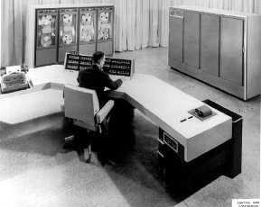
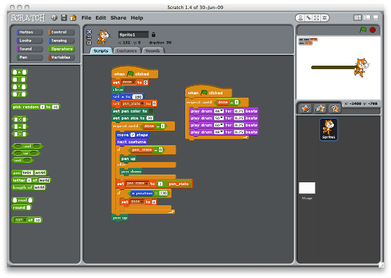

I volunteered to participate in Career Day, at my daughter's elementary
school, and today was the big day. I thought long and hard about how to
describe programming to fourth graders, without boring the crap out of
them. As it happens, the three 25-minute sessions I did went very well. I
thought I'd share my experiences, in case other geek parents find
themselves in this situation.

Some of the kids signed up for my session, because they thought I was going
to talk about programming video games. I told them that very few working
computer programmers are actually video game programmers, just like very
few people who play basketball actually end up in the NBA. "But," I then
said, "I'm going to try to show you that there are many different kinds of
computer programming."

First, I talked about computers, of course:

* how [ginormous][] they were when I was their age
* how they usually resided special, air-conditioned rooms, all by themselves
* how people needed special badges just to get into those rooms and touch
  the computer

[ginormous]: http://www.merriam-webster.com/dictionary/ginormous

I pointed out that, because they were big and expensive, computers had more
limited uses then, unlike today. I said that, today, computers are
*everywhere*. At that point, I asked the kids to name places they knew used
computers. I got the usual responses, such as:

* my house
* my [Nintendo DS][]
* the grocery store
* the cash registers at the cafeteria
* Staples

[Nintendo DS]: http://www.nintendo.com/ds

I then pulled out my [Droid][] phone and asked them if they knew what it
was. They did, of course, though some mistook it for an [iPhone][]. I asked
if it was a computer, and we talked about that for a minute or so. I showed
them the flashlight app for it and talked about how someone actually sat
down and wrote a program to grab the camera's flash and turn it on, and
then put that program out on the web, for others to use.

[Droid]: http://www.samsung.com/global/microsite/galaxys/
[iPhone]: http://www.appled.com/iphone/

Next came the [iPad][]. We talked about how people use them. I showed them
the calculator app, which is hilarious, because the calculator's keys are
so huge on the iPad. We talked about how the calculator keys change when
you change the iPad's orientation, and how someone actually wrote the
program to do that.

[iPad]: http://www.appled.com/ipad/

Then I asked the kids to try to think of some *other* places we can find
computers today, places you don't normally think of finding computers. I
asked them if there were any computers in their cars. Some kids mentioned
the GPS, so I, "Right!", and we talked briefly about how GPS units talk to
satellites and use that information to show where you are on a map, and how
some people actually wrote software to do all that.

Next, I decided to talk about anti-lock brakes. As it happens, the children
had just finished a science unit on simple machines, so the concept of
friction was still fresh in their minds.

"How many of you like to slide across a slippery floor in your socks?" I
asked.

Loads of hands went up in the air.

"So, why does that work?" I responded. "What's missing, that allows you to
zip so fast across the floor?"

Inevitably, at least one child piped up, "Friction!"

"Yes! Could you walk on that floor without friction?"

"No!" came a chorus of responses.

"So, what happens when a car's tires lose friction, say, on ice?"

"It skids!"

At this point, I told them how, when I was learning to drive, we were told
to pump the brakes, which is kind of like skip-stepping on that slippery
floor, to avoid sliding in your socks. This proved to be a very natural way
to describe, in simple terms, how an anti-lock braking system uses its
built-in computer to monitor the slippage of the wheels, how it pumps the
brakes "really, really fast" when the car loses friction, how it doesn't
forget to do that (like we humans can)--*and* how someone had to write the
anti-lock braking software.

In all three sessions, this little discussion resulted in lots of nodding
heads, so, apparently, I hadn't bored the crap out of them so far.

Then we talked a bit about how someone becomes a programmer. When I asked
how that happened, they all said, "School," or some variant. I wanted to
get across how both book-learning and practical play-time were important,
so I invoked science.

"Your teachers are teaching you science, right? So, part of that process is
that they teach you things in class, and they give you homework to do, and
they give you tests. But that's only half of it, right? What's the *other*
half, the really *fun* half?"

Invariably, there was a least one kid who said, "Experiments!"

That not only gave me a chance to invoke [Mythbusters][] (always good for
an, "Oh, yeah!"), but it was a great analogy for describing how learning
programming is *also* part book-learning and part playing.

[Mythbusters]: http://www.discovery.com/mythbusters/

This was a perfect segu&eacute; into the next part: A demo. I had found
[Scratch][], a free, cross-platform programming environment that obviously
has roots in [Logo][]. But, Scratch is like Logo on steroids.

[Scratch]: http://scratch.mit.edu/
[Logo]: http://en.wikipedia.org/wiki/Logo_(programming_language)

In Scratch, you write a program by dragging various widgets from tool bars
onto the canvas, fitting them together like puzzle pieces. They drive a
small screen, where you can add [sprites][], draw lines, and play music,
among other things. A small [Paint][]-like popup allows you to draw your
own sprites, but you can also load prebuilt graphics. Widgets include:

* control structures (loops, `if` statements, etc.)
* sounds (drums, tones, and rests, with adjustable tempos and instruments)
* variables (though I skipped those for this short demo)
* pen-related widgets ("pen up", "pen down", "pen color", etc.)
* movement widgets. (The *set x,y* widgets allowed me to tie the discussion
  into a recent math unit, for instance. But there are other movement
  widgets, like "walk *n* steps".)

[sprites]: http://en.wikipedia.org/wiki/Sprite_(computer_graphics)
[Paint]: http://en.wikipedia.org/wiki/Paint_(software)

When you drag a control into the canvas, you can double click it, and that
fragment runs immediately. Piece it together with others, and you can run
them separately, too. Put them all together, and you have your program. By
creating separate, disconnected pieces, you can get parts that run in
parallel. Scratch even supports an event-driven model, allowing you to
communicate between pieces of your program; this turns out to be the
simplest way to build subroutines.

You get the idea.

So, I had the kids gather around behind me, I knelt on the floor in front
of my laptop (which was on two spare kid desks), and we built a program.

First, we drew a simple sprite. Then, I showed them how to move the sprite
across the screen. We tested that part. Then, we put that action into a
loop, and ran that. (They didn't know it, but they were obviously being
introduced to incremental development.) Then, we added a snail trail, so
the moving sprite left a purple line as he walked across the screen.
(Funny: In all three sessions, when I asked the kids what color the line
should be, they said, almost unanimously, "PURPLE!") Finally, we modified
the loop so that after every step, the sprite stopped briefly, and the
program played two drum tones.

I had about 25 minutes per session, with about 12 kids per session. This
talk format turned out to work really well with that time frame and that
size. The kids were attentive during the talk, since I didn't just lecture
at them, but kept asking them questions. But they were positively rapt
during the programming session. At the end, I told them, "Okay, you're all
now programmers," which, of course, they loved. I also told them that if
they're interested in playing with Scratch, they could have their parents
email me, and I'd tell them how to download it, "because the best way to
decide whether programming is fun or sucky is to try it."

I cannot praise Scratch enough. For this kind of talk, and for introducing
children to programming concepts in a fun way, Scratch seems ideal. I ran
it on my Mac, but it'll run on Linux or Windows. It's written primarily in
Java, with a native executable front-end.

The best part about this whole experience, even better than finding
Scratch, was how much fun I had. Most ten-year-old kids aren't to the "I'm
too snarky and cool for you adults" phase, yet, and they were attentive and
engaged, even during the boring talky parts. I had a blast.

If you're a geek and a parent, I highly recommend sharing your geekitude
with your children and their friends. It's rewarding as all hell.
