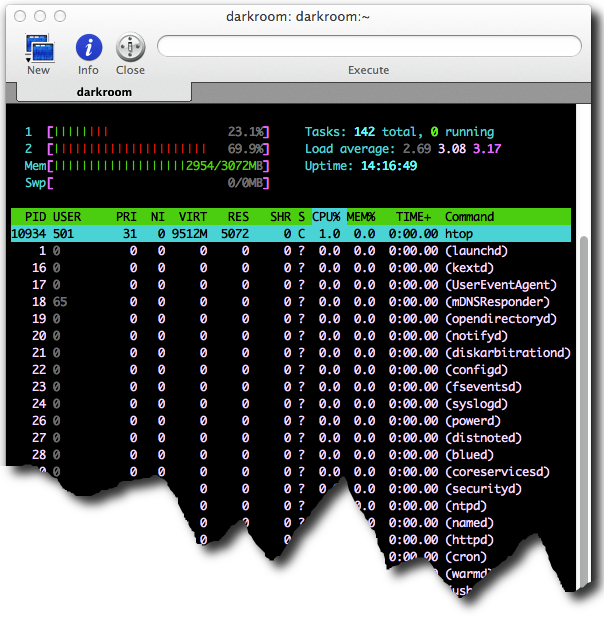

About a month ago, I upgraded my vintage 2006 MacBook Pro to
[Mac OS X Lion][]. It was only $29.95, so, why not?

That decisions turns out to have been a bad one. Lion seems to have been
designed to force me to buy a bright, shiny, expensive, new Mac.

See, my old MacBook Pro tops out at 3Gb of RAM, and Lion seems to be a
memory pig. After moving from Snow Leopard to Lion, I see far more
[spinning beach balls of death][] than before, and my laptop is sluggish to
the point of unusability.

As _htop_(1) shows, below, the system has very little free memory
available.

_htop_ is not to be believed, when it comes to virtual memory, but output
from both _top_(1) and *vm_stat*(1) shows significant swap in use:

The top of _top_(1):

    Processes: 146 total, 5 running, 2 stuck, 139 sleeping, 748 threads    11:28:15
    Load Avg: 2.47, 3.13, 3.43  CPU usage: 15.73% user, 61.98% sys, 22.28% idle
    SharedLibs: 61M resident, 0B data, 13M linkedit.
    MemRegions: 28581 total, 1689M resident, 89M private, 497M shared.
    PhysMem: 289M wired, 1869M active, 851M inactive, 3008M used, 63M free.
    VM: 279G vsize, 1337M framework vsize, 4371493(0) pageins, 98781(0) pageouts.

*vm_stat*(1):

    Mach Virtual Memory Statistics: (page size of 4096 bytes)
    Pages free:                          13738.
    Pages active:                       478298.
    Pages inactive:                     217968.
    Pages speculative:                    2030.
    Pages wired down:                    74137.
    "Translation faults":             27871677.
    Pages copy-on-write:               1256631.
    Pages zero filled:                13202459.
    Pages reactivated:                  301477.
    Pageins:                           4374243.
    Pageouts:                            98781.
    Object cache: 29 hits of 270248 lookups (0% hit rate)

Since cutting over to Lion, I have not suddenly started running lots of
extra applications; if anything, I now routinely kill apps I'm not sure I
need, something I did far less frequently under Snow Leopard.

Clearly, 3Gb of RAM is not enough to run Lion, despite [what Apple says][].

Others are having similar problems. On the Apple Forum, one discussion
[blames AdBlock][]. Even though I use Google Chrome, not Safari, I disabled
AdBlock; doing so does not appear to have made much of a difference.

Someone else claims that Apple is aware of performance complaints and is
rolling out significant performance improvements in [Lion 10.7.2][]. Other
claims that *cron*(1) jobs or login actions that
[run the _purge_(8) command][purge] helps a lot; I may try that approach,
but having to do that seems like a complete [kluge][]--assuming it even works.

Alas, a new Mac is not in the budget right now.

[Mac OS X Lion]: http://en.wikipedia.org/wiki/Mac_OS_X_Lion
[spinning beach balls of death]: http://www.thexlab.com/faqs/sbbod.html
[what Apple says]: http://osxdaily.com/2011/06/07/mac-os-x-10-7-lion-system-requirements/
[blames AdBlock]: https://discussions.apple.com/thread/3193912?start=255&tstart=0
[Lion 10.7.2]: https://discussions.apple.com/message/15916419#15916419
[purge]: https://discussions.apple.com/message/15918659#15918659
[kluge]: http://www.jargon.net/jargonfile/k/kluge.html
