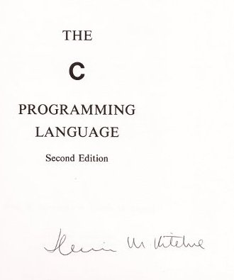

While the world was loudly eulogizing [Steve Jobs'](../118/) death, we lost
another computer science luminary over the weekend. On October 8th, 2011,
[Dennis Ritchie][] died at his home. He was 70.

Ritchie's celebrity and status within computer circles was
well-established. But, unlike Jobs, Ritchie was largely unknown outside our
industry. More's the pity, since his impact on this industry cannot
possibly be overstated.

Dennis Ritchie's list of accomplishments is impressive. Just to skim the
surface, he was co-creator of [Unix][]; co-inventor of the [C][]
programming language; co-author of the classic--and still relevant and
influential--book, *The C Programming Language* (a.k.a., [K&R][]); and
winner of numerous awards, including the prestigious [Turing Award][], the
National Medal of Technology, and IEEE's
[Richard W. Hamming Medal][hamming].

  
The title page of my copy of K&R, Second Edition, signed by Dennis Ritchie

Dennis Ritchie was, by all accounts, a quiet and brilliant man.

His impact on our industry cannot possibly be overstated. [Linux][],
[Mac OS X][], and [Android][] all derive from the work Ritchie and his
colleagues did at Bell Labs. The [POSIX][] standards, an outgrowth of Unix,
have made their way, in part or in full, into nearly all of the popular
operating systems; you'll even see POSIX APIs in Windows. According to
[langpop.com][langpop], C is still the most popular programming language,
and languages directly descended from it (C++, C#, and Java, for example)
also rank in the top 10.

I was fortunate to meet Dennis Ritchie, briefly, at a [Usenix][]
conference, many years ago; his colleague (and my long-time friend),
[Bill Cheswick][], insisted on introducing me. In person, Ritchie
seemed to be quiet and somewhat self-effacing; however, as a Unix
aficianado, I was more than a little awed by the man. I couldn't think of
much to say that wouldn't sound stupid, so I just bought a signed copy of
K&R from him.

We have lost both a brilliant innovator and an amazing programmer.

Rest in peace, Dr. Ritchie.

**UPDATE**: Tim O'Reilly declares October 30th to be
[Dennis Ritchie Day](http://radar.oreilly.com/2011/10/dennis-ritchie-day.html).

[Usenix]: http://www.usenix.org/
[Bill Cheswick]: http://www.cheswick.com/ches/index.html
[langpop]: http://langpop.com/
[POSIX]: http://en.wikipedia.org/wiki/POSIX
[hamming]: http://en.wikipedia.org/wiki/IEEE_Richard_W._Hamming_Medal
[Linux]: http://en.wikipedia.org/wiki/Linux
[Android]: http://www.android.com/
[Mac OS X]: http://www.apple.com/macosx/
[K&R]: http://en.wikipedia.org/wiki/The_C_Programming_Language
[Turing Award]: http://www.acm.org/awards/taward.html
[Dennis Ritchie]: http://en.wikipedia.org/wiki/Dennis_Ritchie
[C]: http://en.wikipedia.org/wiki/C_(programming_language)
[Unix]: http://en.wikipedia.org/wiki/Unix
