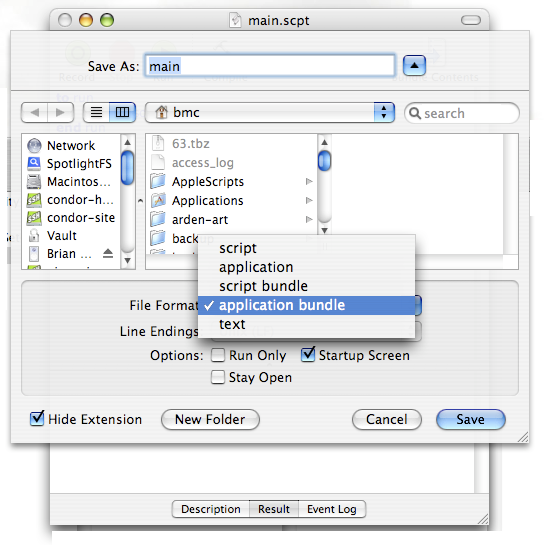
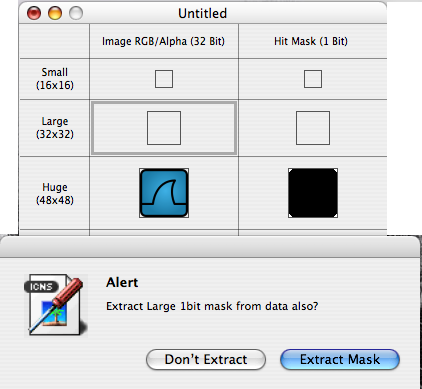

{{
page.articleTemplate: article=%s.html
page.alternateTemplates: printable-article=pr-%s.html
page.title: Wrapping an executable inside a Mac OS X application
page.tags: mac-os-x, unix, software
page.date: 2008-10-22 22:47:16
---
I installed [Wireshark][] on my MacBook Pro via [MacPorts][], because the
prebuilt Wireshark package didn't work on my machine, due to some dynamic
library version conflict. However, I still wanted a Wireshark icon I could
drop into my dock, to permit single-click launching of Wireshark. Long-time
Mac enthusiasts no doubt could wrap a "naked" executable in their sleep,
but doing so was a new exercise to me. This article describes what I did.

[Wireshark]: http://www.wireshark.org/
[MacPorts]: http://www.macports.org/
}}

# Introduction

I installed [Wireshark][] on my MacBook Pro via [MacPorts][], because the
prebuilt Wireshark package didn't work on my machine, due to some dynamic
library version conflict. However, I still wanted a Wireshark icon I could
drop into my dock, to permit single-click launching of Wireshark. Long-time
Mac enthusiasts no doubt could wrap a "naked" executable in their sleep,
but doing so was a new exercise to me. This article describes what I did.
It should work for any executable that isn't wrapped in a Mac OS X
application bundle.

# Create an AppleScript application to run the program

Pull up the AppleScript editor
(*Applications/AppleScript/Script Editor*) and enter the following
script. Replace `/opt/local/bin/wireshark` with the full path to
whatever executable you want to run.

    to run
        do shell script "/opt/local/bin/wireshark"
    end run

Then, save the script as an "application bundle", as shown in the
following dialog box (which comes up if you select "File &gt; Save
As" from the Script Editor's menu).

# Add an Icon

You can stop here if you want. The application you just saved will
run the executable you specified in the script, and you can drag
that application to the dock. However, it's much nicer if there's
an application-specific icon. So, assuming you've already
downloaded a PNG or some other image, here's how to create an
icon.

## Convert your Image to an Icon

Your final icon will be 128x128 pixels. It's not absolutely
necessary to scale your image to that dimension, but doing so gives
you more control over how the scaled image looks. In any case, once
you have the image ready, bring up the Icon Composer, which you'll
find in */Developer/Application/Utilities*. Drag your image into
each of the boxes in the second column. In the top three rows, you
will be asked about a 1-bit mask. (See below.) Select "Extract
Mask" in all cases.

When you're done, save the resulting icon to a file.

## Convert the Icon to a Resource File

Download and install the open source [Icns2Rsrc][] utility. Once its
installed, run it, open the icon file you created above, and save the
result as a resource file.

## Change the Application's Icon

The simplest way to change the application's icon is:

-   Right click on the icon resource file, and select *Get Info*.
-   Right click on your wrapped application, and select *Get Info*.
-   In the info window for the icon file, click on the small icon
    in the upper left. Then press *Command-C* to copy it to the
    clipboard.
-   In the info window for the application, select its small icon,
    then press *Command-V* to paste the new icon.

That's all there is to it.

[Wireshark]: http://www.wireshark.org/
[MacPorts]: http://www.macports.org/
[Icns2Rsrc]: http://www.versiontracker.com/dyn/moreinfo/macosx/11781
